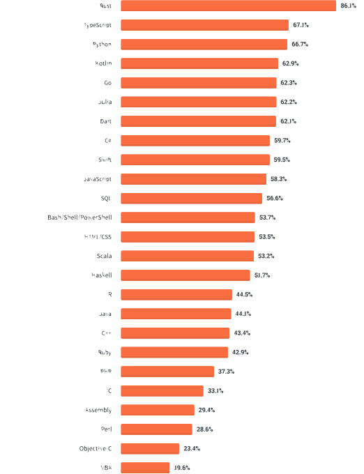
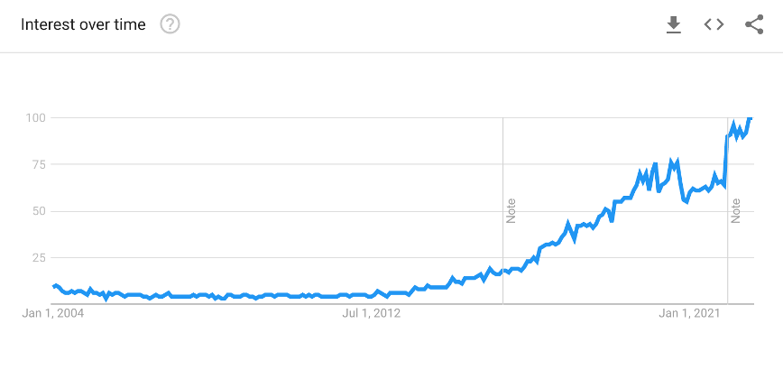

## Programmiersprachen

Programmiersprache
: Eine Programmiersprache ist eine formale Sprache für die Erstellung von Programmen zur Datenverarbeitung an einem Computer. Sie ist durch ihren Zeichensatz, Syntax und ihre Semantik definiert. Die Programmiersprache erlaub es dem Menschen (Programmierer), dem Computer in einer „verständlichen” Form das Programm zu erstellen.

### Generationen der Programmiersprachen

1. Generation - Maschinenorientierte Sprachen sind Programmiersprachen, die ein Prozessor direkt ausführen kann und meist nur für den Prozessortyp verständlich sind. Der Programmcode wird Maschinencode genannt und ist binär (0/1) codiert. 
    ```
      1101 0000 0000 0111 1011
      1011 1111 1110 1000 1010
      1101 0010 0000 0111 1111
    ```

2. Generation – Assemblersprachen nutzen Abkürzungen (ADD, MOV, …) für Maschienenbefehle eines bestimmten Prozessortyps. Der Quelltext eines Assemblerprogramms wird mit Hilfe einer Übersetzungssoftware (Assembler) in Maschinencode übersetzt.
    ```nasm
      CLO
      MOV AL, 2     ;kopiert 2 in Register AL
      ADD AL, 3     ;Addiert 3 zu Register AL
      END
    ```

3. Generation - Höhere Programmiersprachen: orientieren sich am Menschen, dem Programmierer. Ein sogenannter Compiler übersetzt den gegebenen abstrakteren Befehlssatz in den Maschinencode der gegebenen Zielarchitektur oder in eine Zwischensprache.
    ```python
      while i < 20:
          x = x + i * i
          if x > 100:
              i = i + 3
    ```

### Die beliebtesten Programmiersprachen

<!--  -->

Die Entwicklung der Anforderungen an Software entwickeln sich die Softwarearchitekturen und neue Programmiersprachen gewinnen und verlieren an Popularität. So wurden zuerst traditionelle Anwendungssprachen (C++) ersetzt durch Java und C# und dann durch Websprachen (PHP, JavaScript, Perl). Über die letzten 20 Jahren hat sich in diesem Bereich vor allem JavaScript durchgesetzt da es Client- und Serverseitig eingesetzt werden kann. Seit 2017 gewinnt vor allem Python massiv an popularität, da es insbesondere im Bereich KI eingesetzt wird.

<video src="images/top_prog_languages.mp4"></video>


### Python

<!--  -->

Python ist eine ältere Programmiersprache von 1991, die allerdings in den letzten Jahren zunehmend Popularität gefunden hat. Dies ist zum einen darauf zurück zu führen, dass die Sprache sehr auf Lesbarkeit ausgelegt und sehr leicht zu erlernen. Ferner gibt es durch ihr Alter heutzutage sehr viele Bibliotheken für fast jedes Problem, wodurch sie auch sehr vielseitig einsetzbar ist.

Dadurch hat sie sich auch als die wichtigste Sprache in der Data Science entwickelt.

