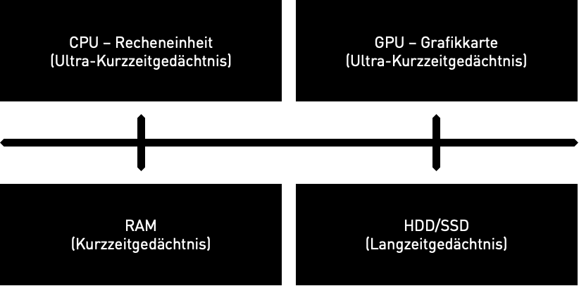

# Computerhardware
# Komponenten

## CPU - Zentrale Verarbeitungseinheit
Die CPU ist die Recheneinheit des Computers und ist zuständig für die Ausführung von Anwendungen und von Berechnungen und Operationen zuständig. Sie bearbeitet eine Sequenz an Befehlen in Form eines Computerprogramms. Moderne CPUs bestehen aus wenigen Rechenkernen (2-32) mit sehr hoher Leistungsfähigkeit um komplexe Berechnungen sehr schnell auszuführen. Eine CPU besteht aus Millionen an Transistoren die nur wenige Nanometer (1000000nm=1cm) groß sind. Wenige Transistoren können nur eine einzelne logische Operation berechnen

## GPU - Grafikkarte
Die Grafikkarte ist verantwortlich für die Verarbeitung von Grafiken (2D, 3D und Videos) und parallelen Berechnungen. In einigen Computern ist die GPU in die CPU integriert, während Gaming-Computer und Workstations oft separate, leistungsstarke Grafikkarten verwenden. Moderne GPUs bestehen aus tausenden sehr einfachen Recheneinheiten, die nur wenig Rechenleistung und Speicher haben, aber durch die Anzahl sehr viele parallele Berechnungen ausführen können im Gegensatz zur CPU.

## RAM - Arbeitsspeicher
Der RAM ist der temporäre Speicher, in dem Daten und Programme während des Betriebs geladen werden. Ein größerer RAM ermöglicht schnellere Leistung und Multitasking-Fähigkeiten.

## HDD/SSD - Festplatte
Die Festplatte ist der dauerhafte Speicher des Computers, auf dem das Betriebssystem, Programme und Daten gespeichert werden. HDDs (Festplattenlaufwerke) speichern Daten auf rotierenden Scheiben, während SSDs (Solid-State-Laufwerke) Flash-Speicher verwenden und in der Regel schneller sind.

## Mainboard mit dem Kommunikationsbus
Das Mainboard ist die Hauptplatine des Computers, auf der CPU, RAM, GPU und andere Komponenten angeschlossen sind. Die Komponenten tauschen Informationen über ein Kommunikationsbus aus.

## Ähnlichkeit zum menschlichem Gedächtniss
Der Computer hat die gleichen Gedächtnisarten wie der Mensch:
- CPU und GPU haben kleine Register und Cache Speicher (Ultra-Kurzzeitgedächtnis)
- Der RAM ist ein volatiler Speicher, d.h. der Inhalt geht beim ausschalten verloren (Kurzzeitgedächtnis)
- Die HDD/SSD ist ein permanenter Speicher, d.h. der Inhalt bleibt erhalten (Langzeitgedächtnis)
