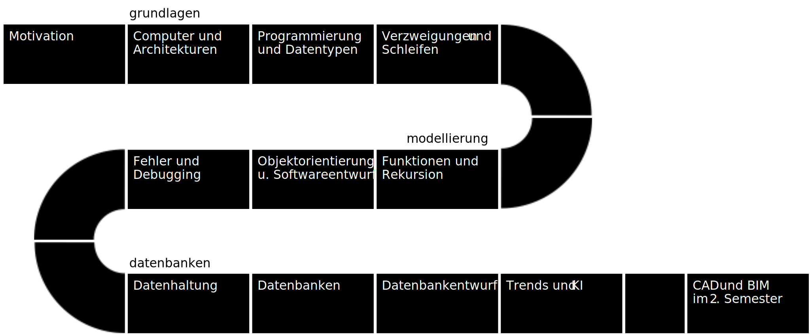

# Programmierung und Datenbanken

In diesem Kurs steht die Aus- und Weiterbildung von Informatikfähigkeiten speziell für den Anwendungsbereich der Bau- und Umweltingenieurswissenschaften im Fokus. Durch die Digitalisierung benötigen Ingenieure und andere technisch Interessierte in diesen Branchen immer häufiger grundlegende Fähigkeiten in der Programmierung, speziell im Bereich des Datenmanagements, -verarbeitung und -analyse. In den Bau- und Umweltingenieurswissenschaften handelt es sich hier z.B. um Datensätze aus Sensormessnetzwerken, Planungsprozessen oder Gebäudedatenbanken. Sehr gebräuchlich für die Arbeit mit solchen Daten ist die Programmiersprache Python mit ihren vielfältigen Programmbibliotheken. Das Bildungsangebot führt daher in die Grundlagen der Programmierung und den Umgang mit Datenbanken und Analysetools in Python ein. Es werden dabei zusätzlich theoretische Informatik-Grundlagen sowie fachspezifische Entwicklungsaspekte an verschiedenen Beispielen vermittelt (z.B. der Umgang mit räumlichen Daten).



Der Kurs gliedert sich in drei Teile:
1. **Grundlagen**: Bietet eine Einführung in Hard- und Software von Computern und in die Programmierung in Python.
2. **Modellierung**: Thematisiert die Modellierung von Problemen mit Funktionen und Objekten und die Lösung von Problemen durch Debugging
3. **Datenbanken**: Gibt einen Überblick in das Management kleiner und größerer Daten durch Dateien und Datenbanken.

<!-- 
- 100/0/0 Motivation & Grundlagen
  - V/-/- Hardware eines Computers
  - V/-/- Logik Gatter
- 75/0/0 Grundkonzepte Informatik
  - V/-/- Wissenspyramide
  - V/-/- Software Architekturen
  - V/-/- Programmiersprachen Grundlagen
  - -/-/Ü Python Grundlagen
  - -/-/Ü Replit Grundlagen
- 100/100/100 Daten und Funktionen
  - V/C/Ü Datentypen
  - V/C/Ü Operatoren
  - V/C/Ü Funktionen
- 100/66/33 Ablauf und Verzweigungen
  - V/C/Ü Verzweigungen
  - V/C/Ü Programmablauf
  - V/-/- Algorithmen
- 100/100/33 Schleifen und Rekursion
  - V/C/- Schleifen
  - V/C/Ü Rekursion
  - V/C/- Such und Sortieralgorithmen
- 100/100/33 Fehler und Debugging
  - V/C/Ü Fehler und Ausnahmen
  - V/C/- Unit-Tests
  - V/C/- Debugging
- 100/100/50 Objektorientierung
  - V/C/Ü Objektorientierung
  - V/C/- Modellierung mit Objekten
- 100/100/66 Softwareentwurf
  - V/C/- Entwurfsvorgehen
  - V/C/Ü Bibliotheken und Pakete
  - V/C/Ü Übungsbeispiel: Hafen von Rotterdam
- 100/100/50 Datenhaltung
  - V/C/Ü Datenhaltung
  - V/C/- Netzwerkkommunikation
- 100/66/33 Datenbanken
  - V/-/- Datenbanken Grundlagen
  - V/C/- Relationale Datenbanken
  - V/C/Ü Tabellen mit SQL abfragen
- 100/100/0 Datenbankentwurf
  - V/C/- Datenbankentwurf
  - V/C/- Tabellen mit SQL anlegen
- 100/0/0 Ausblick
  - V/-/- Trends
  - V/-/- Digitale Zwillinge
  - V/-/- KI

```{tableofcontents}
```
-->
