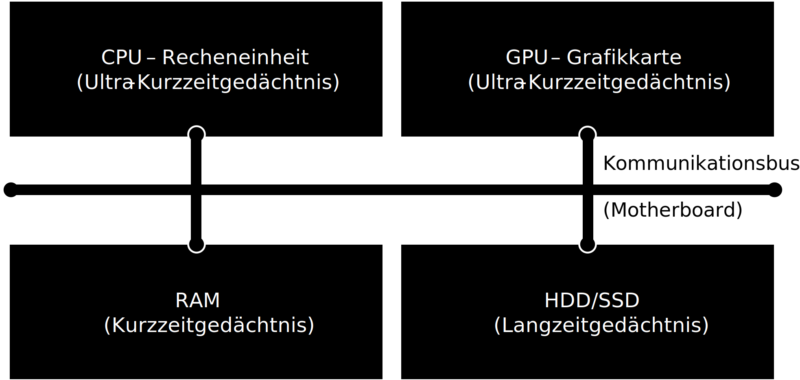

# Computerhardware

## <a href="/slides/01c_Computerhardware.html">Folien</a>
<iframe src="/slides/01c_Computerhardware.html" width="750" height="500"></iframe>

## Computer

:::{admonition} Definition
:class: definition

Computer
: Ein Computer ist ein Gerät, das mittels programmierbarer Rechenvorschriften Daten verarbeitet

:::

## Computerarten

Es gibt viele verschiedene Arten von Computern, die sich in Größe, Leistung und Anwendungsbereich unterscheiden:

- Supercomputer – Spezielle Computer mit sehr vielen CPUs und GPUs zur hochparallelen Verarbeitung komplexer Probleme (z. B. Wettersimulation)
- Mainframe – Spezielle Großrechner mit sehr hoher Zuverlässigkeit z. B. in Banken
- Server – Computer in Rechenzentren ohne Bildschirm für das Internet oder Cloud-Computing
- Personal Computer (PC) – Desktop Computer in Büros oder daheim für Arbeit, Spielen, etc.
- Laptops – Mobile Computer unterwegs fürs arbeiten, spielen, studieren
- Smartphones – Mobiler Rechner mit Touchscreen und wenig Telefonfunktion
- Tablets – Mobiler Computer mit viel Touchscreen und ohne Telefonfunktion
- Eingebettete Computer – kleine Rechner in Autos, Robotern und Smart-Homes

## Komponenten eines Computers

Die Kernmodule eines Computers sind:

- die CPU als zentrale Recheneinheit, 
- die GPU für graphische Anwendungen, 
- der RAM als Arbeitsspeicher und 
- ein Harddrive (HDD) oder Solid State Drive (SSD)

Der Computer hat ähnliche Gedächtnisarten wie der Mensch:
- CPU und GPU haben kleine Register und Cache Speicher (Ultra-Kurzzeitgedächtnis)
- Der RAM ist ein volatiler Speicher, d.h. der Inhalt geht beim ausschalten verloren (Kurzzeitgedächtnis)
- Die HDD/SSD ist ein permanenter Speicher, d.h. der Inhalt bleibt erhalten (Langzeitgedächtnis)

### Zentrale Verarbeitungseinheit CPU
Die CPU (Central Processing Unit) ist die Recheneinheit des Computers und ist zuständig für die Ausführung von Anwendungen und von Berechnungen und Operationen zuständig. Sie bearbeitet eine Sequenz an Befehlen in Form eines Computerprogramms. Moderne CPUs bestehen aus wenigen Rechenkernen (2-32) mit sehr hoher Leistungsfähigkeit um komplexe Berechnungen sehr schnell auszuführen. Eine CPU besteht aus Millionen an Transistoren die nur wenige Nanometer (1000000nm=1cm) groß sind. Wenige Transistoren können nur eine einzelne logische Operation berechnen.

### Grafikkarte GPU
Die Grafikkarte GPU (Graphic Processing Unit) ist verantwortlich für die Verarbeitung von Grafiken (2D, 3D und Videos) und parallelen Berechnungen. In einigen Computern ist die GPU in die CPU integriert, während Gaming-Computer und Workstations oft separate, leistungsstarke Grafikkarten verwenden. Moderne GPUs bestehen aus tausenden sehr einfachen Recheneinheiten, die nur wenig Rechenleistung und Speicher haben, aber durch die Anzahl sehr viele parallele Berechnungen ausführen können im Gegensatz zur CPU.

### Arbeitsspeicher RAM
Der RAM (Random Access Memory) ist der temporäre Speicher, in dem Daten und Programme während des Betriebs geladen werden. Ein größerer RAM ermöglicht schnellere Leistung und Multitasking-Fähigkeiten.

### Festspeicher HDD/SSD 
HDD und SSD (Hard Disk Drive / Solid State Drive) sind die dauerhaften Speicher des Computers, auf dem das Betriebssystem, Programme und Daten gespeichert werden. HDDs (Festplattenlaufwerke) speichern Daten auf rotierenden Scheiben, während SSDs (Solid-State-Laufwerke) Flash-Speicher verwenden und in der Regel schneller sind.

### Mainboard mit dem Kommunikationsbus
Das Mainboard ist die Hauptplatine des Computers, auf der CPU, RAM, GPU und andere Komponenten angeschlossen sind. Die Komponenten tauschen Informationen über ein Kommunikationsbus aus.

## Binären Zahlen

Computer speichern, verarbeiten und übertragen Daten in Form von binären Zahlen. Dies liegt daran, dass Transistoren in der CPU nur zwei Zustände unterscheiden können und somit ausschließlich logische Operationen ausführen. Das Wort „binär“ stammt vom lateinischen „binarius“ und bedeutet „zweifach“ oder „doppelt“. Das binäre System ist das kleinste sinnvolle Zahlensystem und verwendet nur zwei verschiedene Zeichen: 0 und 1. Diese beiden Werte können auf unterschiedliche Weise interpretiert werden, zum Beispiel als „aus“ und „an“, „falsch“ und „wahr“ oder einfach als die Zahlen 0 und 1. Durch die Kombination vieler solcher binärer Stellen (Bits) lassen sich komplexe Daten und Informationen im Computer darstellen und verarbeiten.

:::{admonition} Achtung
:class: warning

Aufgrund der binären Darstellung werden übliche Einheitenvorsätze wie Kilo-, Mega-, etc. auf Basis von 1024 und nicht auf Basis von 1000 definiert.

:::

### Darstellung von ganzen Zahlen im Binärsystem

Grundsätzlich werden ganze Zahlen im Computer in dem Binärsystem dargestellt. Hierfür wird das Dezimalsystem, das auf der Basis 10 beruht und die Ziffern 0 bis 9 verwendet, in das Binärsystem auf der Basis 2 mit den Ziffern 0 und 1 umgerechnet. Jede Stelle einer Binärzahl entspricht einer Potenz von 2, beginnend ganz rechts mit $2^0$. Um eine Dezimalzahl in eine Binärzahl umzuwandeln, wird die Zahl in Summen von Zweierpotenzen zerlegt.

| Dezimal | Binär      | Hexadezimal |
|---------|------------|-------------|
| 0       | 0000       | 0           |
| 1       | 0001       | 1           |
| 2       | 0010       | 2           |
| 3       | 0011       | 3           |
| 4       | 0100       | 4           |
| 5       | 0101       | 5           |
| 6       | 0110       | 6           |
| 7       | 0111       | 7           |
| 8       | 1000       | 8           |
| 9       | 1001       | 9           |
| 10      | 1010       | A           |
| 11      | 1011       | B           |
| 12      | 1100       | C           |
| 13      | 1101       | D           |
| 14      | 1110       | E           |
| 15      | 1111       | F           |

**Beispiel:** Die Dezimalzahl 13 wird so binär dargestellt:
- Zerlegung in Zweierpotenzen: 
  $13 = 8 + 4 + 1 = 2^3 + 2^2 + 2^0$
- In Binärform wird dies als $1101$ geschrieben. Jede Stelle (von rechts nach links) steht für $2^0$, $2^1$, $2^2$, $2^3$, usw. Die Ziffer ist 1, wenn die jeweilige Potenz in der Zahl enthalten ist, sonst 0.
- Man schreibt auch $13_{10} = 1101_2$, also 13 zur Basis 10 und 1101 zur Basis 2.

So kann jede beliebige Zahl als Folge von Nullen und Einsen dargestellt werden. Computer speichern und verarbeiten Zahlen intern immer in dieser binären Form.

### Darstellung von reellen Zahlen im Binärsystem

Reelle Zahlen können im Computer nicht exakt dargestellt werden, da sie oft viele und bis zu unendlich viele Nachkommastellen besitzen können (z. B. $1/3$, $\pi$). Stattdessen verwendet der Computer eine angenäherte Darstellung, die sogenannte Gleitkommazahl (engl. *floating point number*). Diese basiert auf einer Exponentialschreibweise, ähnlich wie in der Mathematik:

$$
\pm\ m \times 10^e
$$

wobei $m$ die Mantisse, $e$ der Exponent und das Vorzeichen $\pm$ ist. Im Computer wird jedoch das Binärsystem verwendet, daher lautet die Darstellung:

$$
\pm\ m \times 2^e
$$

Hierbei ist $m$ die Binärmantisse (zwischen 1 und 2), $e$ der Binärexponent. 

**Beispiel:** Wir möchten die Zahl $-13,25$ als Gleitkommazahl im Format $\pm m \times 2^e$ darstellen:

1. *Vorzeichen:* Die Zahl ist negativ, also $1$.
2. *Dezimalzahl in Binärform:* $13,25_{10} = 1101,01_2$
3. *Exponentialverschiebung:* $1101,01_2 = 1,10101_2 \times 2^3$
4. *Zerlegung* in Mantisse: $1,10101_2$ und Exponent: $3$
5. *Ergebnis:* $-13,25 = -1,10101_2 \times 2^3$

In der Praxis werden die Zahlen meist im standartisierten IEEE 754 Standard als 32-Bit-Gleitkommazahl (*float*) oder 64-Bit (*double*) gespeichert. Dabei werden die Bits zusätzlich aufgefüllt, so dass sie in die 32 oder 64 Bit passen. Dadurch ändert sich die Darstellung etwas:

- Vorzeichenbit: $1$ (negativ)
- Exponent mit Bias: $3 + 127 = 130_{10}$ ($10000010_2$)
- Mantisse mit Nullen aufgefüllt: $10101000000000000000000$
- Die Binärdarstellung im Speicher lautet also: `1 10000010 10101000000000000000000`

So werden beliebige reelle Zahlen im Computer als Gleitkommazahlen nach IEEE 754 gespeichert.

:::{admonition} Grenzen
:class: warning

Durch die begrenzte Anzahl an Bits können nicht alle reellen Zahlen exakt dargestellt werden. Es kommt zu Rundungsfehlern und einer endlichen Genauigkeit.

:::

### Abbildung von Zeichen im Computer

Text wird im Computer als Folge von Zahlen gespeichert, die wiederum binär codiert sind. Jeder Buchstabe, jedes Satzzeichen und jedes andere Zeichen wird durch eine bestimmte Zahl dargestellt. Diese Zuordnung ist in sogenannten Zeichencodierungen wie ASCII oder Unicode festgelegt.

| Kleinbuchstabe | Dezimal | Binär      | Großbuchstabe | Dezimal | Binär      |  Zahlen/Sonderz. | Dezimal | Binär      |
|----------------|---------|------------|---------------|---------|------------|------------------|---------|------------|
| a              | 97      | 01100001   | A             | 65      | 01000001   | 0                | 48      | 00110000   |
| b              | 98      | 01100010   | B             | 66      | 01000010   | 1                | 49      | 00110001   |
| c              | 99      | 01100011   | C             | 67      | 01000011   | 2                | 50      | 00110010   |
| d              | 100     | 01100100   | D             | 68      | 01000100   | 3                | 51      | 00110011   |
| e              | 101     | 01100101   | E             | 69      | 01000101   | 4                | 52      | 00110100   |
| f              | 102     | 01100110   | F             | 70      | 01000110   | 5                | 53      | 00110101   |
| g              | 103     | 01100111   | G             | 71      | 01000111   | 6                | 54      | 00110110   |
| h              | 104     | 01101000   | H             | 72      | 01001000   | 7                | 55      | 00110111   |
| i              | 105     | 01101001   | I             | 73      | 01001001   | 8                | 56      | 00111000   |
| j              | 106     | 01101010   | J             | 74      | 01001010   | 9                | 57      | 00111001   |
| k              | 107     | 01101011   | K             | 75      | 01001011   | !                | 33      | 00100001   |
| l              | 108     | 01101100   | L             | 76      | 01001100   | ?                | 63      | 00111111   |
| m              | 109     | 01101101   | M             | 77      | 01001101   | .                | 46      | 00101110   |
| n              | 110     | 01101110   | N             | 78      | 01001110   | ,                | 44      | 00101100   |
| o              | 111     | 01101111   | O             | 79      | 01001111   | (Leerstelle)     | 32      | 00100000   |

Moderne Computer verwenden oft Unicode (z. B. UTF-8), um auch Zeichen aus anderen Sprachen und Sonderzeichen darstellen zu können. Auch hier werden die Zeichen in Zahlen übersetzt und dann binär gespeichert. So zieht sich die binäre Codierung von Zeichen durch alle Ebenen der Computertechnik, vom Speichern im RAM bis zur Darstellung in der GPU zur Anzeige auf dem Bildschirm.

### Abbildung von Bildern im Computer

Bilder werden im Computer als eine Sammlung von kleinen Bildpunkten, sogenannten Pixeln, gespeichert. Jedes Pixel stellt einen winzigen Teil des Bildes dar und besitzt eine bestimmte Farbe. Um ein Bild digital zu speichern, wird das Bild zunächst in ein Raster aus Pixeln mit einer bestimmten Auflösung (z. B. 1920 × 1080 Pixel) unterteilt.

Die Farbe jedes Pixels wird durch Zahlenwerte beschrieben. Bei Farbbildern wird häufig das RGB-Farbmodell verwendet, bei dem jede Farbe aus den drei Grundfarben Rot, Grün und Blau zusammengesetzt wird. Für jede dieser Farben wird ein Zahlenwert gespeichert, meist im Bereich von 0 bis 255 (das entspricht 1 Byte pro Farbkanal). Ein einzelnes Pixel benötigt somit 3 Byte (24 Bit), um alle Farbinformationen zu speichern.

**Beispiel:** Ein Pixel mit den Werten Rot = 120, Grün = 200, Blau = 150 wird im Computer als drei Zahlen gespeichert. Diese Zahlen werden wiederum in Binärzahlen umgewandelt, z. B.  
- 120 (Rot) → 01111000  
- 200 (Grün) → 11001000  
- 150 (Blau) → 10010110  

Alle Pixel eines Bildes werden so als lange Folge von Binärzahlen im Speicher abgelegt. Dadurch kann der Computer das Bild rekonstruieren, anzeigen oder weiterverarbeiten.

