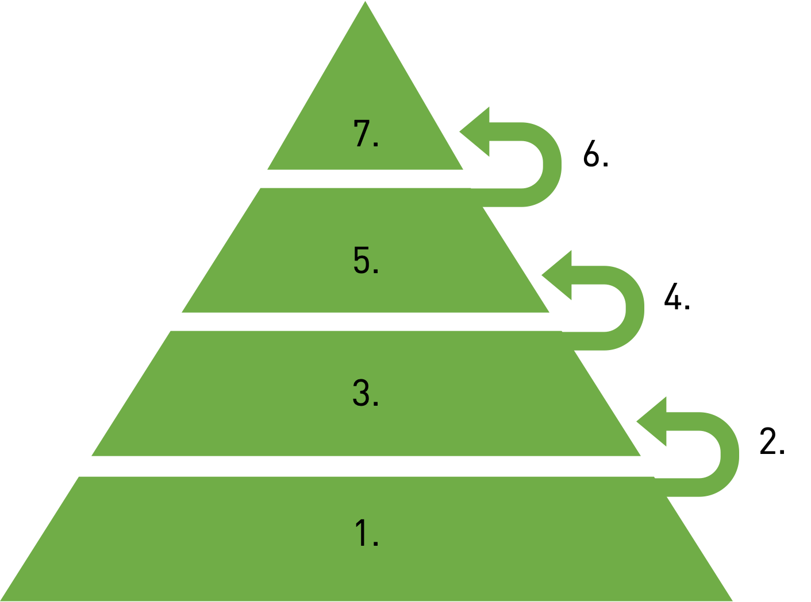
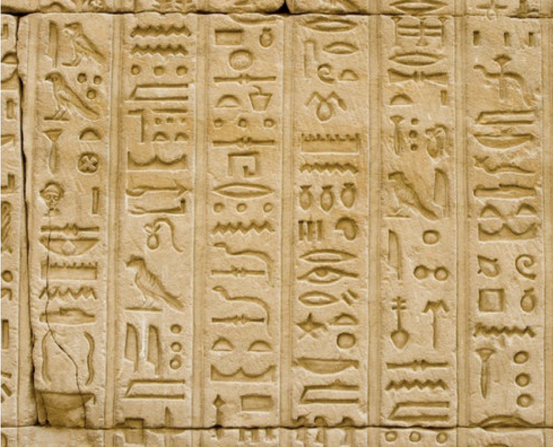

## Wissenspyramide

```{quizdown}
	---
	shuffleQuestions: true
	shuffleAnswers: true
	---

    ### Ordne die Elemente der Wissenspyramide in der Reihenfolge von 1 bis 7 an.

    

    1. Zeichen
    2. Syntax
    3. Daten
    4. Semantik
    5. Information
    6. Verarbeitung
    7. Wissen


    ### Was sind Zeichen?

    - [X] Ein einzelner Buchstabe
    - [X] Eine Ziffer
    - [X] Ein Satzzeichen
    - [ ] Ein Wort
    - [ ] Ein Satz


    ### Was ist Syntax?

    1. [x] Formale Regeln, die definieren, wie wohlgeformte Ausdrücke auf Basis eines Zeichensatzes gebildet werden.
    1. [ ] Vorgaben für die Interpretation von Daten.
    1. [ ] Verknüpfung von Informationen durch Algorithmen, Erfahrungen, Werte und Fachkentnissen.


    ### Was sind Daten?

    1. [ ] Einzelnen Buchstaben, eine Ziffer, ein Sonderzeichen oder ein Steuerzeichen.
    1. [x] Eine wiederholt interpretierbare Darstellung von Information in formalisierter Art.
    1. [ ] Daten, die mit Sinn und Zweck versehen sind. Sie haben Bedeutung und sind für einen bestimmten Zweck organisiert.
    1. [ ] Die gesammelten, verknüpften Informationen über einen bestimmten Sachverhalt, integriert mit persönlichen Erfahrungen.


    ### Was ist Semantik?

    1. [ ] Formale Regeln, die definieren, wie wohlgeformte Ausdrücke auf Basis eines Zeichensatzes gebildet werden.
    1. [x] Vorgaben für die Interpretation von Daten.
    1. [ ] Verknüpfung von Informationen durch Algorithmen, Erfahrungen, Werte und Fachkentnissen.


    ### Was sind Informationen?

    1. [ ] Formale Regeln, die definieren, wie wohlgeformte Ausdrücke auf Basis eines Zeichensatzes gebildet werden.
    1. [ ] Eine wiederholt interpretierbare Darstellung von Information in formalisierter Art.
    1. [x] Daten, die mit Sinn und Zweck versehen sind. Sie haben Bedeutung und sind für einen bestimmten Zweck organisiert.
    1. [ ] Die gesammelten, verknüpften Informationen über einen bestimmten Sachverhalt, integriert mit persönlichen Erfahrungen.


    ### Was ist Verarbeitung?

    1. [ ] Formale Regeln, die definieren, wie wohlgeformte Ausdrücke auf Basis eines Zeichensatzes gebildet werden.
    1. [ ] Vorgaben für die Interpretation von Daten.
    1. [x] Verknüpfung von Informationen durch Algorithmen, Erfahrungen, Werte und Fachkentnissen.


    ### Was ist Wissen?

    1. [ ] Formale Regeln, die definieren, wie wohlgeformte Ausdrücke auf Basis eines Zeichensatzes gebildet werden.
    1. [ ] Eine wiederholt interpretierbare Darstellung von Information in formalisierter Art.
    1. [ ] Daten, die mit Sinn und Zweck versehen sind. Sie haben Bedeutung und sind für einen bestimmten Zweck organisiert.
    1. [x] Die gesammelten, verknüpften Informationen über einen bestimmten Sachverhalt, integriert mit persönlichen Erfahrungen.


    ### Was sind in dem Bild die Zeichen?

    

    1. [x] Jede Hieroglyphe
      > Jede Hieroglyphen stellt ein Zeichen dar
    1. [ ] Jede Spalte
    1. [ ] Bedeutung der Hieroglyphe
    1. [ ] Kontext aller Hieroglyphen


    ### Was ist in dem Bild der Syntax?

    

    1. [ ] Jede Hieroglyphe
    1. [x] Jede Spalte
      > Die Hieroglyphen sind in Spalten angeordnet. Wir lesen sie von oben nach unten und von rechts nach links.
    1. [ ] Bedeutung der Hieroglyphe
    1. [ ] Kontext aller Hieroglyphen

    ### Was ist in dem Bild die Semantik?

    

    1. [ ] Jede Hieroglyphe
    1. [ ] Jede Spalte
    1. [x] Bedeutung der Hieroglyphe
      > Jede Hieroglyphen hat eine kontextspezifische Bedeutung welche  Bildzeichen, Lautzeichen oder Deutzeichen darstellen können.
    1. [ ] Kontext aller Hieroglyphen

    ### Was ist in dem Bild die Verarbeitung?

    

    1. [ ] Jede Hieroglyphe
    1. [ ] Jede Spalte
    1. [ ] Bedeutung der Hieroglyphe
    1. [x] Kontext aller Hieroglyphen
      > Die Hieroglyphen können nur in Ihrem Kontext korrekt Interpretiert werden.
```
