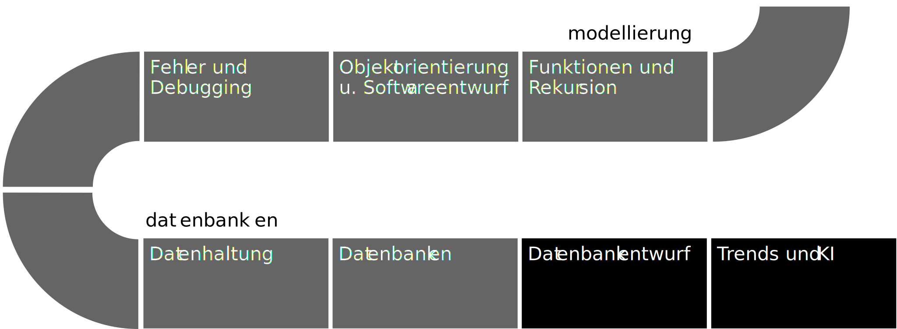
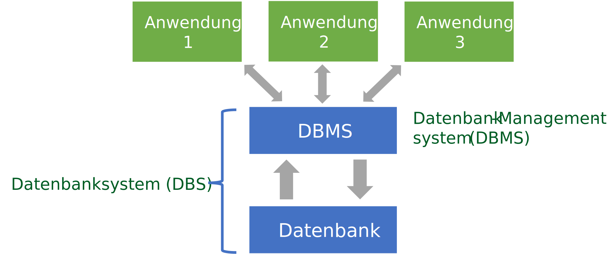

# Datenbanktypen


> Eventually, you have to throw the data over a wall.
>
> - Pat Helland

## <a href="/lec_slides/10a_Datenbanktypen.slides.html">Folien</a>
<iframe src="/lec_slides/10a_Datenbanktypen.slides.html" width="750" height="500"></iframe>

## Ablauf



## Datenbanken Definition 

<div class="alert alert-block alert-success">
<b>📘 Definition: Datenbank</b>

Unter einer *Datenbank (DB)* versteht man die logisch zusammengehörenden Daten, die von einem *DBMS (Datenbankmanagementsystem)* verwaltet werden
</div>

<div class="alert alert-block alert-success">
<b>📘 Definition: Datenbanksystem</b>

Datenbank und Datenbankmanagementsystem zusammen bezeichnet man als *Datenbanksystem*
</div>

Zur Datenbank gehören neben den reinen 'Nutzdaten' auch die für die Verwaltung vom Datenbankmanagementsystem angelegten Objekte (beispielsweise Indizes und Logdateien)


## Warum bringen wir Geld „auf die Bank"?

<div class="flex-row">
  <div class="col4">

- Zentrale und langfristige Aufbewahrung
- Sicherung vor Verlusten
- Effizienz durch spezielles Dienstleistungsangebot (Daueraufträge, Portfolio, …)
- Übersicht behalten
- Vernetzung mit dem globalen Finanznetzwerk

  </div>
  <div class="col6"> 
    <figure class="mj-fig">
        
        <figcaption class="mj-fig-cap">
            Midjourney: thief breaking into a bank safe
        </figcaption>
    </figure>
  </div>
</div>

## Warum bringen wir Daten auf die „Bank"? 

- *Effizienter* speichern und laden von Daten durch verschiedenen Clients (Webserver, Geräte, etc.)
- *Verwaltung* von sehr (sehr) großen Datenmengen (Skalierbarkeit)
- *Organisation* der Daten in vorgegebene Datenstrukturen (Normalisierung)
- *Langfristiges* speichern der Daten (Persistierung)
- *Schnelles* suchen der Daten durch Indexierung
- *Abgesicherte* Prozesse zum Ändern der Daten (Transaktionen)
- *Nachvollziehbares* Verändern von Daten durch Transaktions-Logs
- *Automatische* Datenanalyse (OLAP)

## Grundkonzepte Dateien

- Struktur: Jede Anwendung strukturiert die Daten entsprechend der darin vorkommenden Datenarten (Format, Struktur …).
- Dateisystem: Jede Anwendung legt die Daten entsprechend seiner Anforderungen (Zugriff, Endung, Ort …) ab.


## Grundkonzepte Datenbanken

- Struktur: Alle Anwendung nutzen die gleiche Struktur die in der Datenbank modelliert wurde
- Dateisystem: Alle Anwendungen greifen auf die gleichen Daten zu. Zugriffe werden durch Transaktionen synchronisiert und protokolliert.



## Die Codd'schen Regeln (Codd, 1985, 1990) 

- *Integration*: einheitliche, nichtredundante Datenverwaltung
- *Operationen*: Speichern, Suchen, Ändern
- *Katalog*: Zugriffe auf Datenbankbeschreibungen im Data Dictionary
- *Benutzersichten*: Jeder Nutzer sieht die Daten die er sehen darf in der Art wie er sie sehen möchte
- *Integritätssicherung*: Korrektheit des Datenbankinhalts
- *Datenschutz*: Ausschluss unauthorisierter Zugriffe, nur berechtigte Nutzer
- *Transaktionen*: mehrere DB-Operationen als Funktionseinheit (ganz oder gar nicht)
- *Synchronisation*: parallele Transaktionen koordinieren
- *Datensicherung*: Wiederherstellung von Daten nach Systemfehlern

## Datenbanken Typen - Übersicht


## Relationale Datenbanken 

*RDBMS* werden bereits seit Anfang der 1980er Jahre verwendet und basieren auf dem relationalen (=tabellenorientierten) Datenmodell
- Das Schema einer Tabelle (=Relationenschema) ist definiert durch den Tabellennamen und eine fixe Anzahl von Attributen (=Spalten) mit entsprechenden Datentypen
- Da Daten in Tabellen organisiert werden, sind sie stark strukturiert mit einer durch die Tabelle definierten Struktur (Normalisierung)
- Die Standardsprache zum Aufbau/Änderung/Löschen ist *SQL*

- Populärste Systeme: Oracle | MySQL | Microsoft SQL Server | PostgreSQL | IBM Db2

## NoSQL Datenbanken 

*NoSQL* Datenbankmanagementsysteme sind Datenbanken die kein relationales (=tabellenorientierten) Datenmodell verwenden und damit in der Regel auch kein SQL unterstützen

- Sie finden seit etwa *2009* zunehmend Verbreitung

- Populärste Systeme: MongoDB | CouchDB | Cassandra | Redis | Neo4j | Amazon DynamoDB | HBase | OrientDB

- *Hauptgründe*:
  - Hohe Anforderungen an Skalierbarkeit
  - Fehlertoleranz moderner Web-Applikationen
  - Big Data Szenarien
  - Daten sind oft nur semi-strukturiert (lassen sich nicht in ein Schema pressen)


## Dokumentenorientierte Datenbanken 

*Document Stores* zeichnen sich durch eine *schemafreie* Organisation der Daten aus:

- Datensätze haben keine einheitliche Struktur
- Die Typen der Werte einzelner Spalten können pro Datensatz unterschiedlich sein
- Spalten können mehr als einen Wert haben (Arrays)
- Datensätze können eine verschachtelte Struktur haben
- Zur Darstellung der „Dokumente" wird meist *JSON* verwendet

- Populärste Systeme: MongoDB | Amazon DynamoDB | Databricks | Azure Cosmos DB | Couchbase


## Key-Value Datenbanken 

*Key-Value Stores* sind die wohl einfachste Form von Datenbankmanagementsystemen
- Sie können lediglich Paare von Schlüsseln und Werten abspeichern, sowie die Werte anhand des Schlüssels wieder zurückliefern
- Damit ähneln sie dem *dict* in Python
- Diese Einfachheit macht sie attraktiv für:
  - Ressourcenbegrenzte Systeme wie embedded PCs
  - Entwicklung von Web-Interfaces

- Populärste Systeme: Redis | Amazon DynamoDB | Azure Cosmos DB | Memcached | Hazelcast

## Suchmaschinen Datenbanken 

*Suchmaschinen* sind NoSQL DBMS spezialisiert auf die Suche nach Dateninhalten wie Text:

- Features
    - Unterstützung komplexer Suchbegriffe
    - Volltextsuche
    - Stemming (Stammformreduktion eines Wortes)
    - Ergebnisreihung
    - Gruppierung von Suchergebnissen
    - Verteilte Suche für hohe Skalierbarkeit

- Populärste Systeme: Elasticsearch | Splunk | Solr | OpenSearch | MarkLogic

## Graphdatenbanken 

*Graph DBMS* stellen Datensätze in Form von *Knoten (Nodes)* und *Beziehungen (Edges)* zueinander dar
- Sie ermöglichen insbesondere die *Modellierung von Verbindungen*
- Ideal für Netzwerkanalysen, soziale Netzwerke, Empfehlungssysteme
- Populärste Systeme: Neo4j | Microsoft Azure Cosmos DB | Virtuoso | IBM KITT

## Datenbanken Typen in der Vorlesung 

- Fokus auf: *Relationale DB* (71.9%)
    - Einfach zu benutzen
    - Meist verbreitet
    - Solide Grundlage

- Auch: Key-Value DB:
    - Einfache Konzepte
    - Praktische Übungen

## Datenbanken in Python 

<div class="flex-row">
  <div class="col1">

- Zugriff über jeweils passende Bibliothek der Datenbank
- Oracle, Redis, MongoDB, etc.

  </div>
  <div class="col1"> 
    <figure class="mj-fig">

```python
from replit import db

# Daten speichern
db["entry"] = 5

# Daten abrufen
value = db["entry"]
print(value)  # Output: 5
```

  </div>
</div>

