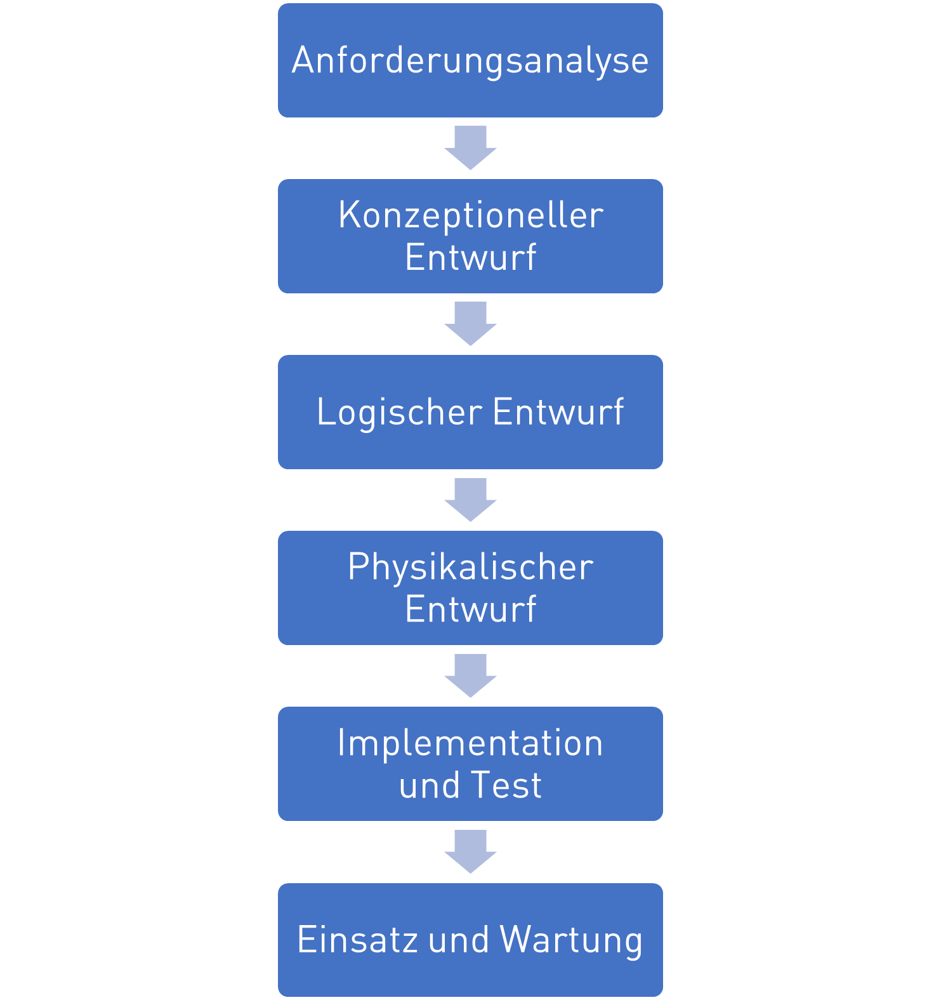
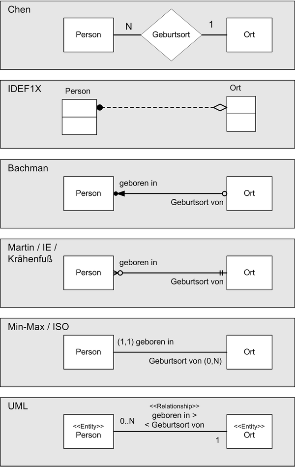

# Entwurf relationaler Datenbanken


> Simple things should be simple. Complex things should be possible.
>
> - Alan Kay

## <a href="/lec_slides/11a_Datenbanken_Entwurf.slides.html">Folien</a>
<iframe src="/lec_slides/11a_Datenbanken_Entwurf.slides.html" width="750" height="500"></iframe>

## Ablauf


## Entwurfsvorgehen

Das klassische Entwurfsvorgehen von Datenbanken ähnelt dem Wasserfallmodell beim Softwareentwurf. Hierbei werden zuerst die Anforderungen und Anwendungsfälle
- Anforderungsanalyse: Welche Anforderungen und Anwendungsfälle stellen sich an die DB?
- Konzeptioneller Entwurf: Grobentwurf in dem im ER-Diagram die benötigten Entitäten, Attribute und Relationen abgebildet werden
- Logischer Entwurf: Detailentwurf des konkreten Datenbankschematas für eine spezielles DBMS das die wirklichen Tabellen in der DB abbildet und normalisiert wird
- Physikalischer Entwurf: Finale Festlegungen von Primärindexen und zusätzlicher Suchindexe zur Zugriffsoptimierung
- Implementation und Test: Erstellung der Datenbank mit SQL
- Einsatz und Wartung: Verwendung der Datenbank

Entscheidend in dem Vorgehen ist, dass es mit dem Konzeptioneller Entwurf einen Grobentwurf gibt, in der die funktional notwendigen Entitäten entworfen werden und einen nachfolgenden Detailentwurf mit dem Logischen und Physikalischen Entwurf, in dem die eigentlichen Tabellen in einem DBMS abgeleitet werden, welche sich meist unterscheiden, wie nachfolgend dargestellt.



## ER-Diagramme

Zur Darstellung der Entwürfe von Datenbanken nutzt man Entity-Relationship Diagramme. In ihnen visualisiert man die Entitäten mit Ihnen Attributen und die Relationen zwischen den Entitäten. Es gibt verschiedene varianten von ER-Diagrammen, wie in der folgenden Abbildung dargestellt. Gemein ist allen, dass sie Entitäten, Attribute (hier nicht dargestellt) und Relationen mit Kardinalitäten darstellen. Sie unterscheiden sich primär in der Notation, als im Gebrauch von Symbolen.


Wir benutzen im Folgenden die UML-Notation, welche auf UML-Klassendiagrammen basiert.

Klassen erhalten die Anmerkung `<<Entity>>` um sie von normalen Klassen abzugrenzen
- Attribute (Tabellenspalten) werden als Klassenattribute mit ihrem Datentyp dargestellt
- Primärschlüssel werden mit PK gekennzeichnet
- Relationship-Attribute (Fremdschlüssel) werden mit Assoziationen modelliert
- Die Leserichtung von Relationstypen wird mit `<<` oder `>>` angegeben
- Zahlen an Relationships geben die Kardinalität an

Ein wichtiger Unterschied zu UML-Diagrammen ist, dass es in ER-Diagrammen keine Methoden, Vererbung, Polymorphismus, Kapzelung, Klassenhierarchien gibt. Wir wenden also entsprechende Symbole nicht an.

Ein einfaches Beispiel stellt das folgende Bild dar. Wir haben eine Person, die in einem Ort wohnt. Die Person hat die Attribute Ausweisnummer und einen Namen. Wir nutzen die Ausweisnummer als Primärschlüssel, da sie eindeutig ist. Der Ort hat eine Postleitzahl und einen Namen. Die Postleitzahl dient hier als Primärschlüssel der einfachheit halber (Da eine Postleitzahl viele Gemeinden umfassen kann oder ein Ort mehrere Postleitzahlen haben kann ist dies nicht ideal). Als Relation kennzeichnen wir hier, dass eine Person in genau einem Ort wohnt. Zu beachten ist hier die Leserichtung `>>` und die Kardinalitäten 1 zu 1 die am Anfang und Ende der Relation stehen.

<center></center>

## Kardinalitäten

In ER-Diagrammen spielt dabei insbesondere die Kardinalität von Relationen eine wichtige Rolle, da sich daraus unterschiedliche Tabellendarstellungen ableiten. Die Kardinalitäten beschreiben die Anzahl an minimalen und maximalen möglichen Beziehungen zwischen Entitäten für diese Beziehung. Grundsätzlich unterscheidet man die folgenden Kardinalitäten:

<table>
    <tr>
        <td style="width: 10%">Kardinalität</td>
        <td style="width: 40%">Beispiel</td>
        <td style="width: 50%">ER-Diagramm</td>
    </tr>
    <tr>
        <td>1 zu 1</td>
        <td>Eine Person ist geboren in minimal einem, maximal einem Ort.</td>
        <td></td>
    </tr>
    <tr>
        <td>1 zu 0..1</td>
        <td>Eine Person ist gestorben in minimal Null, maximal einem Ort.</td>
        <td></td>
    </tr>
    <tr>
        <td>1 zu 0..*</td>
        <td>Eine Person macht Ferien in minimal Null, maximal vielen Orten.</td>
        <td></td>
    </tr>
    <tr>
        <td>1 zu 1..*</td>
        <td>Eine Person war bereits in minimal einem, maximal vielen Orten.</td>
        <td></td>
    </tr>
</table>

Es ist dabei zu beachten, dass die Leserichtung (`<<` oder `>>`) wichtig ist, da keine Aussage über die Kardinalität der Gegenrichtung gemacht wird! Es wird in dem obigen Beispiel also nur eine Aussage gemacht, in wie vielen Orten *eine* Person war und nicht darüber wie *viele* Personen in Orten sein können.

## Beispiel: ER Konzeptentwurf für Geometrieobjekte

Als Entwurfsbeispiel greifen wir auf die im Kapitel [Objektorientierung](7a_Objects.html) behandelten Beispiel der Geometrieobjekte. Wir haben die Klassen `Point`, `Line` und `Polygon` mit den Varianten `Triangle`, `Tetragon` und `Pentagon`.

Der `Point` hat als Attribute die `x` und `y` Koordinaten vom Datentyp `float`, welche beide als `public` gekapselt sind, da mit `+` annotiert. Ferner gibt es unterschiedliche Methoden in `Point`, `Line` und `Polygon` zur Berechnung der Distanz, Fläche und Länge der jeweiligen Objekte.

Im UML Diagramm haben wir dargestellt, dass ein `Polygon` die Aggregations-Assoziation mit der Multiplizität `1` zu `3..*` zur Klasse `Point` hat, also ein Polygon mit mindestens drei Punkten verknüpft ist. Die `Line` ist wiederum assoziiert mit dem Punkt `Point` mit der Multiplizität `1` zu `2`, also sind einer Linie genau zwei Punkte zugeordnet. 

Die Klassen `Triangle`, `Tetragon` und `Pentagon` sind Unterklassen von `Polygon`, welche keine weitere Funktionalität hinzufügen.

<center></center>

Um für diese Objekte ein Datenbankschema zu entwerfen, führen wir sie in ein ER-Diagram über, indem wir die oben dargestellten Konvertierungsregeln anwenden. 
- Wir annotieren die Klassen als erstes mit `<<Entity>>`, um sie als solches zu kennzeichnen. 
- Wir entfernen alle Methoden, da ER-Diagramme sie nicht unterstützen.
- Wir entfernen alle Kapselungsannotationen `+`, `-` oder `#` vor Attributen
- Wir fügen Primärschlüssel zu allen Entitäten hinzu
- Wir wandeln die Speziellen Assoziationstypen Aggregation und Composition in einfache Assoziationen um

Da es in ER-Diagrammen und DBMS keine Vererbung gibt, müssen wir uns überlegen wie wir mit den Unterklassen `Triangle`, `Tetragon` und `Pentagon` verfahren. Eine Möglichkeit wäre es für jede eine neue Entität einzuführen, die genauso wie ein Polygon aufgebaut ist. Das führt aber zu mehreren redundant aufgebauten Tabellen. Dies ist notwendig wenn die Unterklassen eigene Attribute einführen würden. Da sie das allerdings nicht tun, brauchen wir auch auch keine separaten Entitäten, sondern können Sie in der generischen Entität Polygon mit aufnehmen, indem wir das Attribut `PolygonType` einführen, in dem wir speichern können, ob es sich um ein `Triangle`, `Tetragon`, `Pentagon` oder Untertyp handelt.

Wir erhalten den folgenden Konzeptentwurf:

<center></center>

In dem Konzeptentwurf gibt es drei Entitätstypen. Die Entität `Point` besitzt weiterhin `x` und `y`-Koordinate als die Attribute vom Datentyp `float`. Die Entität `Line` besitzt zwei Relationen zu `Point` für den Start-Punkt und End-Punkt. Die Entität `Polygon` hat die Relation mit der Kardinalität `1` zu `3..*` zu Punkt, umfasst also mindestens drei Punkte. Sie hat auch ein neues Attribut `PolygonType` vom Datentyp `str` um den Untertyp zu speichern. Für alle drei Entitäten haben wir einen numerischen Primärschlüssel definiert, da numerische Indexe sind mit am effizientesten sind.

## Normalisierung von Konzeptentwürfen zu Logischen Entwürfen

Die Normalisierung ist ein wichtiger Schritt im Prozess der Abbildung eines Konzeptionellen Datenmodells auf ein Logisches und Physikalisches Datenmodell. Sie hat den Zweck, Redundanzen (mehrfaches Festhalten des gleichen Sachverhalts) zu minimieren, indem neue Tabellen erzeugt und durch neue Relationen verknüpft werden für
- komplexe Attribute (Listen, Dictionaries)
- Relationen mit hoher Kardinalität
- Redundante Daten (z.B. Polygontyp)

Man unterscheidet dabei verschiedene Normalformen mit fortschreitend strengeren Bedingungen an das Datenbankschema:
- 1NF - 1. Normalform: Alle Attributwerte sind atomar - das heißt, dass jede Information innerhalb einer Tabelle eine eigene Tabellenspalte bekommt und zusammenhängende Informationen, wie zum Beispiel die Postleitzahl und der Ort, oder komplexe Attribute wie Listen oder Diktionaries nicht in einer Tabellenspalte gespeichert werden.
- 2NF - 2. Normalform: Nicht-Schlüssel Attribute sind von allen Primärschlüsseln voll funktional abhängig - das heißt, dass nur Informationen die funktional zusammen hängen in einer Entität gespeichert werden. Zum Beispiel wird zu einer Rechnung nicht direkt der Name des Kunden gespeichert, sondern diese gehören zu einer separaten Entität Kunde, da ein Kunde ja mehrere Rechnungen haben kann. Wenn man ein ER-Diagramms erstellt und über die Entitäten nachdenkt, so wendet man meist automatisch die 2. Normalform an.
- 3NF - 3. Normalform: Nicht-Schlüssel Attribute sind nur von Primärschlüssel abhängig - das heißt, dass redundante Attribute die zusammengehören zusammen abgespeichert werden. So treten Postleitszahlen und Ortsnahmen paarweise auf und sollten eine separate Entität bilden. 
- BCNF - Boyce-Codd-Normalform: Alle Attribute von denen Attribute abhängen sind Schlüssel - das heißt, dass wenn mehre Fremdschlüssel in einer Entität auftreten und diese voneinander abhängen, so wird diese Abhängigkeit auch wieder in eine Entität ausgelagert. Speichert man zum Beispiel Ortsnahmen und Postleitzahlen in separaten Entitäten (Weil sich ja Ortsnamen doppeln), so darf man nicht die Fremdschlüssel PLZ und Ortsname in der Kundenentität speichern, sondern braucht immer noch die Entität PLZ-Ortsname.
- 4NF - 4. Normalform: Es gibt nur noch triviale mehrwertige Abhängigkeiten - das heißt, dass wenn mehrwertig Attribute mit Fremdschlüssel oder anderen mehrwertigen Attributen auftreten, mit denen sie funktional nichts zu tun haben, so werden diese ausgelagert. Zum Beispiel ist es in der 4NF falsch bei einer Bestellung die Lieferanschrift, Kundennummer und die Artikelnummern in einer Tabelle zu speichern, da die Lieferanschrift mit der Kundennummer zusammenhängt, aber nicht mit den Artikelnummern. Korrekt sind zwei Tabellen mit Lieferanschrift und Kundennummer und eine mit Artikelnummer und Kundennummer.
- 5NF - 5. Normalform: Es gibt keine mehrwertigen Abhängigkeiten, die voneinander abhängig sind  - das heißt das jeder Zusammenhang zwischen einem Attributen und Fremdschlüssel in eine eigene Tabelle ausgelagert wird.

Meistens sind nur die ersten drei Normalformen im Datenbankentwurf relevant. Höhere Normalformen resultieren in sehr vielen kleinteiligen Tabellen, die auch für einfache Anfragen immer durch Joints zusammengesetzt werden müssen, was die Benutzbarkeit drastisch einschränkt.

An unserem Geometrie-Beispiel wollen wir uns einige Beispiele anschauen, für eine Verletzung der 1. bis 3. Normalform.

Im dem folgenden ER-Diagramm verletzen wir die 1. Normalform, da wir ein komplexes Attribut `List<Punkt>` definieren, statt dieses als Relation aufzulösen.

<center></center>

Im zweiten ER-Diagramm verletzen wir die 2. Normalform verletzt, da wir die Koordinaten des Start- und End-Punktes direkt in der Linie speichern, obwohl diese Punkte darstellen und somit einen funktionalen Zusammenhang haben. Hier ist die Lösung diese in die Entität `Punkt` auszulagern und Relationen zu erzeugen.


<center></center>


Im letzten Beispiel speichern wir fehlerhaft das Attribut PolygonTyp in der Entität Punkt, obwohl sie zu der Entität Polygon gehört.

<center></center>

## Normalisierung von Kardinalitäten

Entsprechend der 1. Normalform müssen wir Kardinalitäten entsprechend ihrer Ordnung unterschiedlich abbilden. Dabei können einfache Kardinalitäten (0 oder 1) als Attribut gespeichert werden, wärend höhere Kardinalitäten `>1` als Relation in einer neuen Entität abgebildet werden. Hierbei spielt es im Logischen und Physikalischen Entwurf eine Rolle ob ein Attribut beim speichern einer neuen Entität in der Datenbank nicht angegeben werden muss (`Nullable`) oder zwingend angeben werden muss (`Not Null`).

<table>
    <tr>
        <td style="width: 10%">Kardinalität</td>
        <td style="width: 40%">Beispiel</td>
        <td style="width: 50%">ER-Diagramm</td>
    </tr>
    <tr>
        <td>1 zu 1</td>
        <td>Die Relationen werden durch Fremdschlüssel in der Entität von der die Relation startet `>>` abgebildet. Der Fremdschlüssel ist `Not Null`, also ein Eintrag muss IMMER vorhanden sein.</td>
        <td></td>
    </tr>
    <tr>
        <td>1 zu 0..1</td>
        <td>Die Relation wird mit Fremdschlüssel in der Entität abgebildet. Der Fremdschlüssel ist `Nullable`, also ein Eintrag muss NICHT vorhanden sein.</td>
        <td></td>
    </tr>
    <tr>
        <td>1 zu 0..*</td>
        <td>Die Relation wird als neue Entität mit Fremdschlüssels abgebildet.</td>
        <td></td>
    </tr>
    <tr>
        <td>1 zu 1..*</td>
        <td>Die Relation wird als neue Entität mit Fremdschlüssels abgebildet. Mindestens ein Eintrag sollte vorhanden sein (Das ist eine Konsistenzregel, die sich in einer DBMS nicht erzwingen lässt (es gibt sonst ein Henne-Ei-Problem).).</td>
        <td></td>
    </tr>
</table>

## Beispiel Geometrie

Um den oben erstellten Konzeptentwurf für die Geometrieobjekte in ein Logischen Entwurf zu überführen, müssen wir den Entwurf normalisieren. Schauen wir uns den Entwurf noch einmal an.

<center></center>

Wir haben die drei Entitäten `Linie`, `Punkt` und `Polygon` mit zwei 1:1-Relationen von `Linie` zu `Punkt` und einer 1:3..*-Relationen von `Polygon` zu `Punkt`.

Wenden wir zuerst die Regeln der 1NF an und lösen diese Relationen auf entsprechend der oben gennanten Tabelle, so können wir die zwei 1:1-Relationen von `Linie` zu `Punkt` durch Fremdschlüssel in der Entität `Linie` darstellen.

Die 1:3..*-Relationen von `Polygon` zu `Punkt` hingegen ist entsprechend der 1NF nicht direkt abbildbar, da wir eine Multiplizität größer 1 haben und wir müssen eine neue Entität einführen. Diese Entität (Tabelle) listet welche Polygone, welche Punkte benutzen. Die neue Entität enthät also die zwei Fremdschlüssel und einen neuen Primärschlüssel. Im Logischen Entwurf führen wir auch die Fremdschlüssel als Attribut mit auf, um diese Eindeutig mit darzustellen.

<center></center>

In diesem Entwurf ist die 2NF und 3NF ist breits erfüllt.

Allerdings haben wir viele Dopplungen (Redundanzen) bei dem Attribut `PolygonTyp`, welche ja nur die Werte `Triangle`, `Tetragon` und `Pentagon` annehmen kann, aber jedes mal als neuer String gespeichert werden muss. Gleichzeitig wollen wir ja auch, dass dieses Attribut nur diese Werte annimmt und nicht mit Kauderwelsch gefüllt wird. Deshalb ist es sinnvoll hier die Werte zu begrenzen und die Dopplung von Strings zu vermeiden indem wir eine neue Entität `PolygonType` einführen. Diese definiert die Grundtypen `Triangle`, `Tetragon` und `Pentagon` und weißt ihnen einen numerischen Primärschlüssel zu, den wir in der Entität `Polygon` als Fremdschlüssel referenzieren.

Zu guter letzt definieren wir noch für alle Attribute und Fremdschlüssel ob sie `Nullable` oder `NotNull` sind.

Wir erhalten den finalen Logischen Entwurf:

<center></center>

Wichtig zu erkennen in dem logischen Entwurf ist, dass wir jetzt nur noch 1:1-Relationen haben, also alle höherwertigen Kardinalitäten aufgelößt haben. Zusätzlich haben wir Redundanzen aufgelößt und haben jetzt ein sehr effizienten Datenbankentwurf.

Im Physikalischen Entwurf würde man diesem Entwurf jetzt noch weitere Informationen hinzufügen, wie zum Beispiel zusätzliche Zugangangsbeschränkungen oder Abfrageindizies. Zugangsbeschränkungen gibt es in den meisten DBMS nur auf Entitätsebene und nicht auf Attributsebene (wie in UML), man kann also Beschränken welche Nutzer, welche Tabellen sehen, lesen, erzeugen, oder verändern können, aber nicht welche Spalten sie sehen. 

Beim Entwurf von Abfrageindizies ist die Regel, dass man versucht alle häufig genutzten `WHERE`-Bedingungen, die man in `SELECT`-Anfragen in SQL benutzt, durch entsprechende Indizies beschleunigt werden.

Damit sind wir auch schon direkt im SQL Thema wo wir uns mit der Erzeugung von Tabellen beschäftigen wollen.

## Entwurfsvorgehen bei Datenbanken

Das klassische Entwurfsvorgehen ähnelt dem Wasserfallmodell beim Softwareentwurf

1. *Anforderungsanalyse*: Welche Anforderungen und Anwendungsfälle stellen sich an die DB?
2. *Konzeptioneller Entwurf*: Grobentwurf im ER-Diagramm mit Entitäten, Attributen und Relationen
3. *Logischer Entwurf*: Detailentwurf des konkreten Datenbankschemas für spezielle DBMS
4. *Physikalischer Entwurf*: Primärindexe und Suchindexe zur Zugriffsoptimierung
5. *Implementation*: Erstellung der Datenbank mit SQL
6. *Wartung*: Verwendung der Datenbank


## Entity-Relationship Modell - Einführung

- Entity-Relationship Modelle entwerfen das Datenmodell einer Datenbank
- Legen fest: *was*, *wie* und mit *welchen Zusammenhängen* gespeichert wird
- Häufig in Dokumentationen und Ausschreibungen von Software zu finden
- Entwickelt 1976 von Peter Chen: *"The Entity-Relationship Model"*
- *Verschiedene Varianten* von ER-Diagrammen existieren

## ER-Modell - Grundbegriffe

<div class="flex-row">
  <div class="col1">

*Zentrale Konzepte:*

- *Entitätstyp (Entity Type)*: Klasse von Objekten (Beispiel: Punkt, Linie, Polygon)

- *Entität (Entity)*: Einzelnes identifizierbares Objekt (Beispiel: Ein einzelner Punkt)

  </div>
  <div class="col1"> 

*Weitere Komponenten:*

- *Attribute*: Eigenschaften einer Entität (Beispiel: x,y-Koordinaten eines Punktes)

- *Beziehung (Relationship)*: Zusammenhänge zwischen Entitäten (Beispiel: Punkt 0,0 "gehört_zu" Linie 1)

  </div>
</div>

## Diagrammarten - Verschiedene Notationen 

<div class="flex-row">
  <div class="col1">

*Historische Entwicklung:*
- *Chen-Notation* (Peter Chen, 1976)
- *IDEF1X* (USA Behörden Standard, 1985)  
- *Bachman-Notation* (Charles Bachman, 1969)
- *Krähenfuß-Notation* (Gordon Everest, 1976)
- *(min, max)-Notation* (Jean-Raymond Abrial, 1974)

*Moderne Ansätze:*
- *UML* als ISO-Standard (Ersatz für ER-Diagramme)

  </div>
  <div class="col1"> 
    <figure class="mj-fig">
        
        <figcaption class="mj-fig-cap">
            https://de.wikipedia.org/wiki/Datei:ERD_Darstellungen.png
        </figcaption>
    </figure>
  </div>
</div>

## Begriffsunterschiede - Terminologie

| Objektorientierung | Relationale Datenbank | ER-Diagramme |
|--|--|--|
| Objektinstanz | Datentupel | Entität |
| Klassen | Relationen | Entitätstyp |
| Klassendefinition | Relationenschema | Entity-Relationship-Modell |
| Attribute | Attribute | Attribute |
| Assoziation | Fremdschlüssel | Relationen |
| Multiplizitäten | - | Kardinalitäten |


## OOP vs. Relationale Datenbanken - Vergleich

| Merkmal                  | Objektorientierung | Relationale Datenbanken |
|--------------------------|--------------------|-------------------------|
| Modellierung              | ✅ als Objekte     | ✅ als Relationen       |
| Attribute                 | ✅                 | ✅                      |
| Methoden                  | ✅                 | ❌                      |
| Vererbung                 | ✅                 | ❌                      |
| Polymorphismus            | ✅                 | ❌                      |
| Generalisierung           | ✅                 | ❌                      |
| Aggregation               | ✅                 | ❌                      |
| Kapselung                 | ✅                 | ✅                      |

## Objektorientierter Softwareentwurf

Im objektorientierten Softwareentwurf wird ein *Programm aus Objekten* modelliert:

- *Klassendefinition*: Wie sind Objekte in Form von Klassen definiert?
- *Attribute und Methoden*: Welche Eigenschaften und Verhalten besitzen sie?
- *Vererbung*: Wie bauen Klassen aufeinander auf?
- *Statische Beziehungen*: Wie stehen sie in Referenz zueinander?
- *Dynamische Interaktion*: Wie interagieren sie zur Laufzeit?

*Modellierungssprache*: UML-Diagramme


## Datenbankentwurf 

Im Datenbankentwurf wird eine *Datenbank aus Entitäten* modelliert:

- *Entitätstypen*: Wie sind sie in Form von Tabellen definiert?
- *Attribute*: Welche Eigenschaften besitzen Entitäten als Spalten?
- *Statische Beziehungen*: Wie stehen sie in Relation zueinander?

*Modellierungssprache*: Entity-Relationship Diagramme

## UML für ER-Diagramme - Besonderheiten

<div class="flex-row">
  <div class="col1">

- Klassen mit `<<Entity>>` annotieren
- Attribute als Klassenattribute mit Datentyp
- *PK* kennzeichnet Primärschlüssel
- Fremdschlüssel als Assoziationen
- Leserichtung: `<<` oder `>>`
- Zahlen geben *Kardinalität* an
- *Keine Methoden!*

  </div>
  <div class="col1"> 


  </div>
</div>

## Kardinalitäten (Multiplizitäten)

<table>
    <tr>
        <td style="width: 30%">Kardinalität</td>
        <td style="width: 70%">ER-Diagramm</td>
    </tr>
    <tr>
        <td>1 zu 1: Eine Person ist geboren in minimal einem, maximal einem Ort</td>
        <td></td>
    </tr>
    <tr>
        <td>1 zu 0..1: Eine Person ist gestorben in minimal Null, maximal einem Ort</td>
        <td></td>
    </tr>
    <tr>
        <td>1 zu 0..*: Eine Person macht Ferien in minimal Null, maximal vielen Orten</td>
        <td></td>
    </tr>
    <tr>
        <td>1 zu 1..*: Eine Person war bereits in minimal einem, maximal vielen Orten</td>
        <td></td>
    </tr>
</table>

## Vom Konzeptionellem Modell zum Logischen Modell

- Unterschiedliche DBMS bieten unterschiedliche Datentypen
- Komplexe Attribute (Listen, Dictionary) können nicht direkt abgespeichert werden
- Relationen mit Multiplizitäten >1 können nicht in einer Tabelle mit der Entität abgespeichert werden
- Redundante Daten (z.B. Polygontyp oder Adressen) mit immer den gleichen Werten kosten unnötig Speicher und sind schlecht zu pflegen (Aktualisierung an vielen Stellen)
- Diese Beschränkungen führen dazu dass Konzeptionelle Datenmodelle oft nicht direkt in einer Datenbank abbildbar sind


## Normalisierung

<div class="alert alert-block alert-success">
<b>📘 Definition: Normalisierung</b>

Die Normalisierung ist ein wichtiger Schritt im Prozess der Abbildung eines Konzeptionellen Datenmodells auf ein Logisches und Physikalisches Datenmodell. Sie hat den Zweck, Redundanzen (mehrfaches Festhalten des gleichen Sachverhalts) zu minimieren, indem:
</div>

- komplexe Attribute in neue Tabellen ausgelagert werden
- Relationen mit hoher Kardinalität in neue Tabellen ausgelagert werden
- Redundante Daten (z.B. Polygontyp) in neue Tabellen ausgelagert werden


## Normalformen

Verschiedene Normalformen mit fortschreitend strengeren Bedingungen an das Datenbankschema:

- *1. Normalform:* Alle Attributwerte sind atomar (nicht komplex)
- *2. Normalform:* Nicht-Schlüssel Attribute sind von allen Primärschlüsseln voll abhängig
- *3. Normalform:* Nicht-Schlüssel Attribute sind nur von Primärschlüssel abhängig
- *Boyce-Codd-Normalform:* Alle Attribute von denen Attribute abhängen sind Schlüssel
- *4. Normalform:* Es gibt nur noch triviale mehrwertige Abhängigkeiten
- *5. Normalform:* Es gibt keine mehrwertigen Abhängigkeiten, die voneinander abhängig sind

Dies sorgt für sehr viele, sehr stark vereinfachten Tabellen, die wieder zu größeren Relationen zusammengesetzt werden können.

*Meistens sind nur die ersten drei Normalformen im Datenbank-Alltag relevant.*

## Erste Normalform

- *Beispiel:* Erste Normalform verletzt
- *Fehler:* List<Punkt> als Attribut statt Relation

<div class="flex-row">
  <div class="col1">

```sql
-- Falsch: Komplexe Attribute
CREATE TABLE Polygon (
    id INT PRIMARY KEY,
    punkte LIST<Punkt>  -- Verletzt 1NF
);
```

  </div>
  <div class="col1"> 

```sql
-- Richtig: Atomare Attribute
CREATE TABLE Polygon (
    id INT PRIMARY KEY
);

CREATE TABLE PolygonPunkte (
    polygon_id INT,
    punkt_id INT,
    FOREIGN KEY (polygon_id) REFERENCES Polygon(id),
    FOREIGN KEY (punkt_id) REFERENCES Punkt(id)
);
```

  </div>
</div>

## Zweite Normalform

- *Beispiel:* Zweite Normalform verletzt
- *Fehler:* Punkt nicht ausgelagert


<div class="flex-row">
  <div class="col1">

```sql
-- Falsch: Nicht voll abhängig vom Primärschlüssel
CREATE TABLE Linie (
    id INT PRIMARY KEY,
    start_x FLOAT,
    start_y FLOAT,
    end_x FLOAT,
    end_y FLOAT
);
```

  </div>
  <div class="col1"> 

```sql
-- Richtig: Punkte ausgelagert
CREATE TABLE Punkt (
    id INT PRIMARY KEY,
    x FLOAT,
    y FLOAT
);

CREATE TABLE Linie (
    id INT PRIMARY KEY,
    start_punkt_id INT NOT NULL,
    end_punkt_id INT NOT NULL,
    FOREIGN KEY (start_punkt_id) REFERENCES Punkt(id),
    FOREIGN KEY (end_punkt_id) REFERENCES Punkt(id)
);
```

  </div>
</div>


## Dritte Normalform

- *Beispiel:* Dritte Normalform verletzt
- *Fehler:* PolygonTyp von Polygon abhängig

<div class="flex-row">
  <div class="col1">

```sql
-- Falsch: Transitive Abhängigkeit
CREATE TABLE Polygon (
    id INT PRIMARY KEY,
    typ_name VARCHAR(50),
    typ_beschreibung VARCHAR(200)
);
```

  </div>
  <div class="col1"> 

```sql
-- Richtig: PolygonTyp ausgelagert
CREATE TABLE PolygonTyp (
    id INT PRIMARY KEY,
    name VARCHAR(50),
    beschreibung VARCHAR(200)
);

CREATE TABLE Polygon (
    id INT PRIMARY KEY,
    typ_id INT,
    FOREIGN KEY (typ_id) REFERENCES PolygonTyp(id)
);
```

  </div>
</div>


## Kardinalitäten (Multiplizitäten)

Kardinalitäten werden unterschiedlich abgebildet:
- *1 zu 1:* Relation wird mit Fremdschlüssel in der Entität abgebildet. Der Fremdschlüssel darf NICHT NULL
- *1 zu 0..1:* Relation wird mit Fremdschlüssel in der Entität abgebildet. Der Fremdschlüssel darf NULL
- *1 zu 0...*:* Relation wird als neue Entität mit Fremdschlüssels abgebildet
- *1 zu 1...*:* Relation wird als neue Entität mit Fremdschlüssels abgebildet. Mindestens ein Eintrag sollte vorhanden sein


## Hörsaalfrage

<script>setSectionBackground('#FFD966');</script>
<div class="flex-row">
  <div class="col4 vcent">

Welche Tabellen brauchen wir für unser Geometriebeispiel?

  </div>
  <div class="col6"> 
    <figure class="mj-fig">
    
    </figure>
  </div>
</div>

## Hörsaalfrage

<script>setSectionBackground('#FFD966');</script>
<div class="flex-row">
  <div class="col4">

Durch Normalisierung erhalten wir *fünf Tabellen:*

- *Punkt:* Besitzt die Attribute x,y-Koordinate, Datentyp float
- *Linie:* Start- und End-Punkt sind Fremdschlüssel die NichtNull sind da eine 1-1-Relation vorliegt
- *Polygon:* Eine Tabelle mit PK und FK auf den PolynomTypen, die Punkte sind extern
- *PolygonTyp:* Eine Tabelle der redundanten Polygontypen mit Name (Dreieck, Viereck, etc.) und PK
- *PolygonPunkte:* Eine Tabelle die für jeden Polygon FK, die zugehörigen Punkte FK listet, da eine 3..* Relation vorlag
- *Für alle fünf* brauchen wir einen Primärschlüssel (Immer Not Null)

  </div>
  <div class="col6"> 
    <figure class="mj-fig">
    
    </figure>
  </div>
</div>
