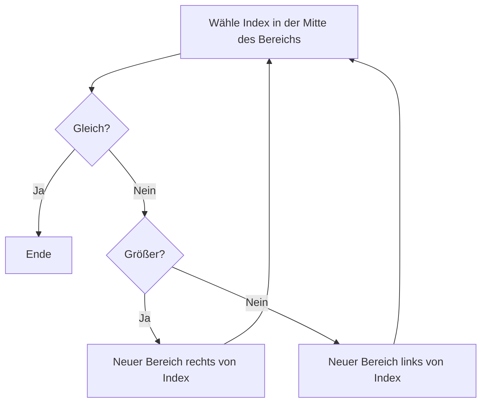
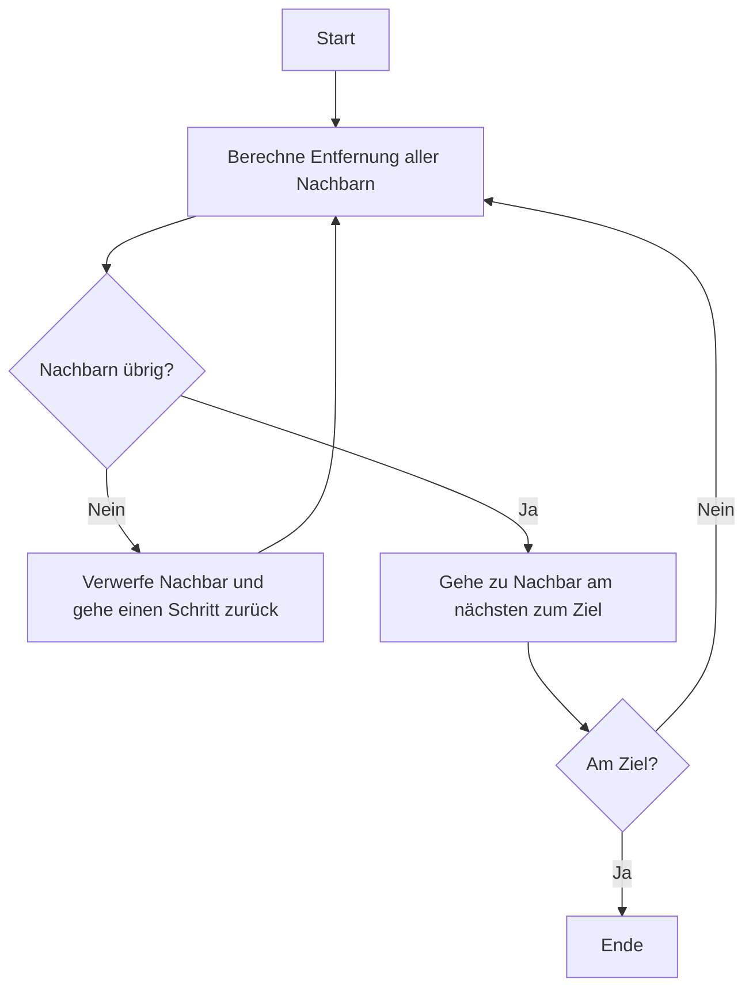
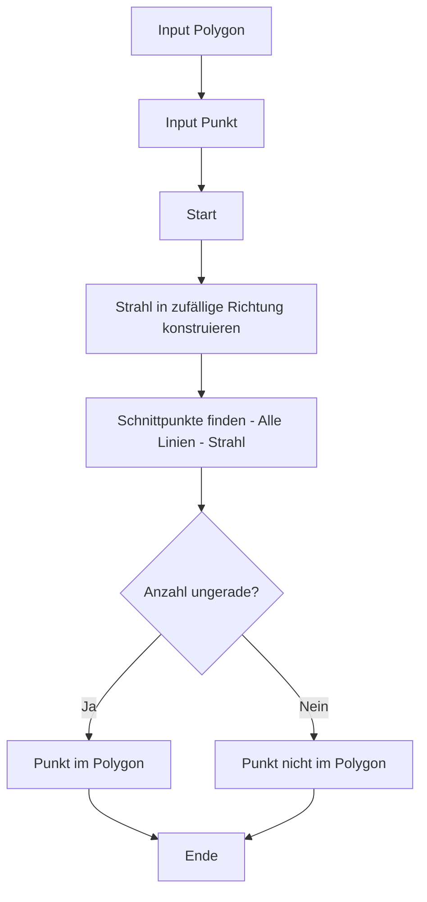

## Programmkonzeption - Algorithmen

- *Definition:* Algorithmen sind wohldefinierte, eindeutige Handlungsanweisungen.

- *Bekannte Beispiele:*
  - Schriftliche Division
  - Dreieckskonstruktion

- *In der Informatik-Praxis:* computerausführbar und endlich

- Programmieren bedeutet Algorithmen und Datenstrukturen so zu kombinieren, dass man von der gewünschten Eingabe zur gewünschten Ausgabe kommt.


## Exkurs – Beispiel für – Teile und Herrsche – Binäre Suche

::: {style="display: flex; gap: 2rem; align-items: center;"}

::: {style="flex: 1;"}
- Finde den Index einer Zahl in einer Liste (z. B. um zu prüfen ob die Zahl in einer Menge (set) vorkommt)

- Anstatt die ganze Liste zu durchsuchen, teil man die Liste rekursiv in zwei Teile und schaut ob die gesuchte Zahl gleich (gefunden), größer (rechts) oder kleiner (links) in der Liste ist
:::

::: {style="flex: 1;"}

:::

:::


## Programmkonzeption - Heuristiken

- Basieren nicht auf wohldefinierten oder eindeutigen Schritten, sondern auf praktischen Erfahrungen

- Versuchen schnell ein hinreichend korrektes Ergebnis zu erreichen. *KEINE* Garantie die optimale Lösung zu finden.

- *Beispiel:*
  - Die Schätzung eines Experten
  - Schrittweises Annähern


## Exkurs – Beispiel für eine Heuristik: A*Star Suchalgorithmus

::: {style="display: flex; gap: 2rem; align-items: center;"}

::: {style="flex: 1;"}
- Die Wegsuche gehört zu den *komplexesten Problemen* in der Informatik (NP-Komplex: Aufgrund des kombinatorischen Problems)

- A* ist eine Heuristik um den kürzesten Weg zwischen zwei Punkten in einem Feld mit Hindernissen zu finden
:::

::: {style="flex: 1;"}

:::

:::


## Beispielproblem - Befindet sich ein Punkt X in einem Polygon?

::: {style="display: flex; gap: 2rem; align-items: center;"}

::: {style="flex: 1;"}
- Ein Polygon ist ein *beliebiges Vieleck*

- Die Lösung dieses Problems ist ein häufiger Teil von Berechnungen in den Bau- und Umweltwissenschaften, z. B. um zu testen, ob ein geplantes Objekt in einem Naturschutzgebiet liegt.
:::

::: {style="flex: 1;"}
{fig-alt="Beispiel eines Polygons"}

*Quelle: https://de.wikipedia.org/wiki/Polygon*
:::

:::


## Hörsaalfrage {.center}

### Wie kann ich bestimmen ob ein Punkt in einem Polygon liegt?

*Google Maps Beispiel*


## Hörsaalfrage {.center}

### Was sind die Ein- und Ausgaben?

*Google Maps Beispiel*


## Beispielproblem - Was sind unsere Aus- und Eingaben?

*Eingaben:*
- Die Position des Punktes X
- Ein Linienzug der den Rand des Polygons beschreibt
- Eine Liste von verbundenen, aufeinanderfolgenden Linien

*Ausgaben:*
- Ein Boolean


## Beispielproblem - Entwerfen eines Algorithmus

::: {style="display: flex; gap: 2rem; align-items: flex-start;"}

::: {style="flex: 1;"}
*Was sind Berechnungen, die man auf Punkten und Linien ausführen kann?*

- Wir können prüfen ob der Punkt genau auf einer Linie liegt.
- Wir können prüfen auf welcher Seite einer Linie ein Punkt liegt.

*Reicht Punkt 2 aus?* Für konvexe Flächen - ja:
- Befindet sich der Punkt auf der gleichen Seite aller Linien des Polygons, befindet er sich im Polygon.
- Trifft aber nicht für konkave Flächen zu => es handelt sich also um eine *Heuristik!*
:::

::: {style="flex: 1;"}
*Konvexes Polygon* vs *Konkaves Polygon*

```
    Konvex:     Konkav:
     /\          /\
    /  \        /  \___
   /____\      /       \
                \      /
                 \____/
```
:::

:::


## Beispielproblem - Entwerfen eines Algorithmus (2)

- *Entwurf bedeutet oft* ein Problem aus verschiedenen Richtungen zu betrachten und neue Berechnungsperspektiven zu finden.

- *Hier:* Die Krux ist ob eine Fläche konkav oder konvex ist. Man bestimmt diese Eigenschaften durch das Ziehen von Linien und Schnitttests.

- *Liegt der Schlüssel zu diesem Problem also in den Schnitttests zwischen Linien?*

- Gibt es eine Linie vom gesuchten Punkt X zu einem anderen Punkt Y, deren Schnittpunkte mit den Polygon-Linien eine Antwort auf die Fragestellung geben?


## Beispielproblem - Entwerfen eines Algorithmus (3)

*Die Antwort:* Jeder beliebige Punkt außerhalb des Polygons!

- Liegt Punkt X *innerhalb* des Polygons dann wird die gezogene Linie die Grenze mindestens einmal schneiden.

- Läuft die gezogene Linie zufällig durch einen konkaven Bereich dann wird es zwei weitere Schnittpunkte geben, für insgesamt *3 Schnittpunkte, oder 5, oder ...*

- Liegt der Punkt X *außerhalb* wird es also entweder *keine Schnittpunkte* geben, oder *2, oder 4, oder ...*

- *Das Problem kann also auf die Anzahl von Schnittpunkten reduziert werden!*


## Beispielproblem - Als Programmablaufplan aufzeichnen

*Beispiele:*

- *Strahl 1* hat 1 Schnittpunkt → *ungerade = innenliegend*
- *Strahl 2* hat 3 Schnittpunkte → *ungerade = innenliegend* 
- *Strahl 3* hat 5 Schnittpunkte → *ungerade = innenliegend*


## Beispielproblem - Als Programmablaufplan aufzeichnen




## Beispielproblem - Welche Funktionen müssen implementiert werden?

- *Strahl konstruieren*

- *Schnitttest zwischen Strahl und Linien*

- *Eine Funktion, die die Inputs annimmt und die anderen Funktionen aufruft.*
  - Diese zentrale Funktion wird meistens *main-Funktion* genannt.


## Programmkonzeption - Beispielproblem

*Wie setzt man den Schnitttest über die Linien programmiertechnisch um?*

- Man müsste die selbe Anweisung (Schnitttest) für jede Linie einmal ausführen, abhängig davon wie viele Linien das Polygon hat.

- *Mit unseren derzeitigen Mitteln nicht machbar!*

- Eines der wichtigsten Programmierwerkzeuge fehlt uns noch: *Schleifen und Iteration*

- *Dazu mehr in der nächsten Vorlesung!*


## Hörsaalfrage {.center}

### Fragen?

*DALL·E 2: A psychedelic DJ with a question mark for a head*